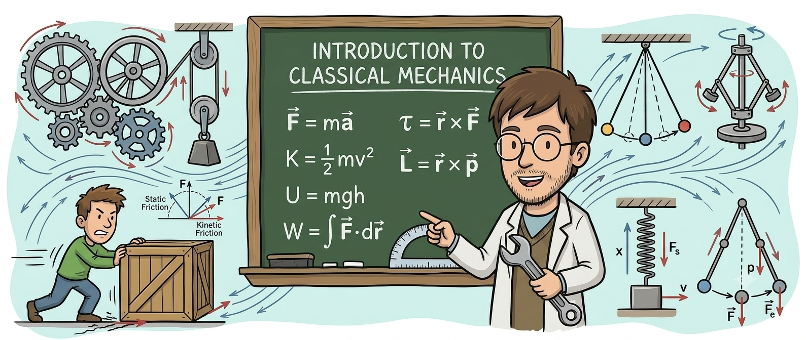

# 02YMECH: Mechanics (!Under Construction!)

Welcome to the repository for **02YMECH: Mechanics**. Here you can find all the material related with the course.

* If you are taking the course for the first time, reading the [SYLLABUS](./syllabus/main.pdf) is strongly recommended.
* The handwritten lecture notes are derived from different sources but mostly from the textbook by Thornton, Marion, *Classical Dynamics of Particles and Systems* (5th edition). These notes are experimental; there can be mistakes and inconsistencies. Students are encouraged to read the reference books in the syllabus for a more detailed explanation of the topics covered in the course.
* The homework is provided for self study. Students are not required to return their solutions, but they are encouraged to work on them to better understand the material.
* You can also find the midterm and final exam questions from previous years in the repository. (The solutions are incomplete, as this is still ongoing work.)

If you wish to download all materials at once, click the green `<> Code` button at the top of this repository and select "Download ZIP", or clone the repository via Git. However, keep in mind that the repository can be updated during the semester, so please check for changes regularly.

## Course Materials

| Chapter                                        |                       Lecture Notes                       |                            Homework                            |                               Solutions                               |
| :----------------------------------------------- | :---------------------------------------------------------: | :--------------------------------------------------------------: | :----------------------------------------------------------------------: |
| **1. Mathematical Tools**                      |      [📝 View Notes](./notes/mathematical-tools.pdf)      |      [📄 View HW](./homework/mathematical-tools/main.pdf)      |      [📝 View Solutions](./solutions/mathematical-tools/main.pdf)      |
| **2. Kinematics**                              |        [📝 View Notes](./notes/electrostatics.pdf)        |        [📄 View HW](./homework/electrostatics/main.pdf)        |        [📝 View Solutions](./solutions/electrostatics/main.pdf)        |
| **3. Dynamics**                                |  [📝 View Notes](./notes/electric-fields-in-matter.pdf)  |  [📄 View HW](./homework/electric-fields-in-matter/main.pdf)  |  [📝 View Solutions](./solutions/electric-fields-in-matter/main.pdf)  |
| **4. Conservation Theorems**                   |        [📝 View Notes](./notes/magnetostatics.pdf)        |        [📄 View HW](./homework/magnetostatics/main.pdf)        |        [📝 View Solutions](./solutions/magnetostatics/main.pdf)        |
| **5. Small Oscillations**                      |  [📝 View Notes](./notes/magnetic-fields-in-matter.pdf)  |                               -                               |                                   -                                   |
| **6. Central Force Motion**                    |       [📝 View Notes](./notes/electrodynamics.pdf)       |       [📄 View HW](./homework/electrodynamics/main.pdf)       |       [📝 View Solutions](./solutions/electrodynamics/main.pdf)       |
| **7. Dynamics of System of Particles**         |    [📝 View Notes](./notes/electromagnetic-waves.pdf)    |    [📄 View HW](./homework/electromagnetic-waves/main.pdf)    |    [📝 View Solutions](./solutions/electromagnetic-waves/main.pdf)    |
| **8. Motion in a Noninertial Reference Frame** | [📝 View Notes](./notes/special-theory-of-relativity.pdf) | [📄 View HW](./homework/special-theory-of-relativity/main.pdf) | [📝 View Solutions](./solutions/special-theory-of-relativity/main.pdf) |
| **9. Gravitation**                       | [📝 View Notes](./notes/special-theory-of-relativity.pdf) | [📄 View HW](./homework/special-theory-of-relativity/main.pdf) | [📝 View Solutions](./solutions/special-theory-of-relativity/main.pdf) |
| **10. Rigid Body Motion**                       | [📝 View Notes](./notes/special-theory-of-relativity.pdf) | [📄 View HW](./homework/special-theory-of-relativity/main.pdf) | [📝 View Solutions](./solutions/special-theory-of-relativity/main.pdf) |

## Recordings

The lectures are recorded and are available on YouTube: [2025](https://www.youtube.com/playlist?list=PLHcyKkvX9MRPdaoV0E9BW5ooefuORE0K5)

